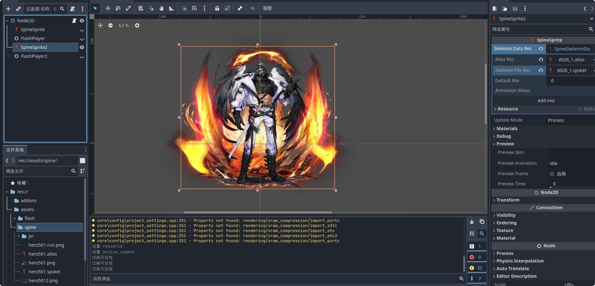
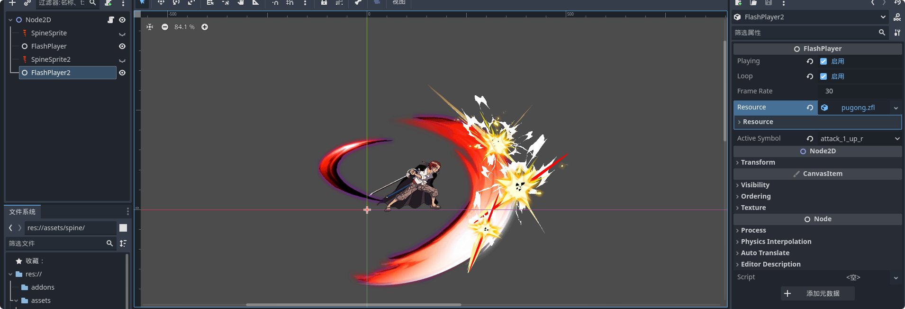

# 本项目下插件仅在Godot 4.3引擎测试，使引擎支持spine3.8和flash动画

## 引用代码：
> https://github.com/funexpected/godot-flash-module/tree/godot4

> https://github.com/esotericsoftware/spine-runtimes

## Spine文件格式
骨骼文件格式支持以下后缀,根据喜好定义：
.spjson
.spine-json
.spskel
.skel
图集使用.atlas

##  效果

spine:

flash:

